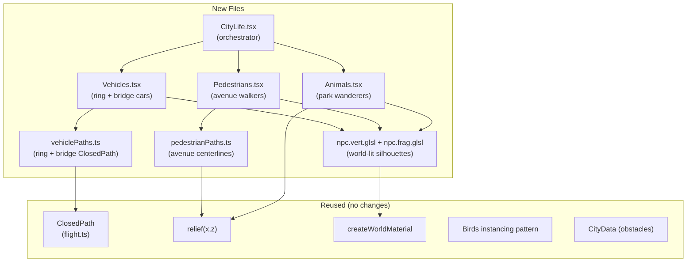

# Living City + Explore Mode

## What this plan does

Two features that transform the cinematic flyover into a living world:

1. **City Life Layer** -- ambient NPCs (vehicles, pedestrians, animals) visible during the normal flyover AND in explore mode
2. **Explore Mode** -- the user takes control of Nova and walks through the city at ground level with a third-person camera

---

## Deep Audit Findings (from [3D](70e94d46-266a-425b-a3e2-70a92ec20625), [nav](0225b7ea-8c93-4842-833c-9da876154ab4), [anim](751bcc62-e0c5-43ac-8394-aa59f7248472), [roads](b4b161f9-6a7b-48d0-ad7d-0de23b870ddd), [Nova](2654fd76-0768-4522-9ca9-47c7d1c2eaf3) audits)

### Existing infrastructure we can reuse

- **`relief(x, z)`** ([relief.ts](frontend/src/experience/city/layout/relief.ts)) -- terrain height query at any world coordinate, pure function, deterministic
- **`ClosedPath`** in [flight.ts](frontend/src/experience/city/birds/flight.ts) -- arc-length path sampler with velocity/orientation; production-grade, used by birds
- **Birds instancing** in [Birds.tsx](frontend/src/experience/city/parts/Birds.tsx) -- `InstancedBufferAttribute` + `DynamicDrawUsage` + per-frame `writeBirds()` pattern, perfect template for NPCs
- **`RING`** (radius 35, height 3.7) and **`BRIDGE_PATH`** (9-point CatmullRomCurve3) in [cityConfig.ts](frontend/src/experience/city/cityConfig.ts) -- ready parametric paths for vehicles
- **`ANCHORS`** in [landmarks.ts](frontend/src/experience/city/landmarks.ts) -- world positions of every district landmark for waypoints
- **`DOMES`** positions, `COUNCIL_TOWER`, `OBSERVATORY` in cityConfig -- obstacles + destinations
- **`towers[]`, `lowRise[]`, `trees[]`** in `CityData` ([generateCity.ts](frontend/src/experience/city/layout/generateCity.ts)) -- obstacle data for collision
- **Walk clip + `NovaAnimator`** -- walk animation with root motion stripped; `novaBrain.resolvePose()` handles idle/walk/gesture transitions; `measureWalkSpeed` gives foot speed
- **`FilmDirector`** phases `approach | entry | descent | city` -- extend to `explore`
- **Hex street math** in `avenueDistance()` (private in generateCity.ts) + `terrain.frag.glsl` -- derive walkable avenue paths
- **`createWorldMaterial`** -- shared world shading for any new mesh (time-of-day, fog, alert)

### What does NOT exist yet

- No ground path graph (streets are shader-drawn hex grid, no polylines)
- No navmesh or walkability grid
- No third camera mode, no user input for movement
- Nova is camera-attached (NDC-space placement), never on the terrain
- No ground vehicles (shuttles were removed, replaced by birds)

---

## Part A: City Life Layer (ambient NPCs)

### Architecture



### Vehicles (`~30 on ring, ~8 on bridge`)

- **Paths**: ring road = circle at `(CITY_CENTER.x, RING.height, CITY_CENTER.z)` radius 35; bridge = `CatmullRomCurve3` from `BRIDGE_PATH`. Create `ClosedPath` instances (ring is naturally closed; bridge returns along a parallel lane).
- **Geometry**: simple capsule/box (~0.8 x 0.4 x 0.35 world units) via `BoxGeometry` or `BufferGeometry`
- **Rendering**: instanced mesh, one draw call. Attributes: `iPos` (xyz + scale), `iDir` (heading xyz + speed). Updated every frame like birds.
- **Shader**: extend `world.glsl` for NPC coloring -- dark body + emissive headlights at night (`uNuit`), tail lights on bridge descent. Stylized silhouette, NOT realistic car model.
- **Behavior**: constant speed along path with slight variation per vehicle; two "lanes" (offset from center). Seeded from `CITY_SEED`.
- **Frame hook**: `useFrame` at `FRAME_PRIORITY.details`, skip if `director.stage !== 'city'`.
- **Quality**: `light` tier = fewer vehicles (15 ring, 4 bridge).

### Pedestrians (`~50-80 figures`)

- **Paths**: derive 6 radial avenue centerlines from the hex math in `avenueDistance()` (export it or duplicate). Each avenue = ~8 waypoints from center outward. Also a corridor along the tree-lined approach (`z = 6..30`).
- **Geometry**: tall capsule (~0.3 world units = human scale in this city). `CapsuleGeometry(0.04, 0.04, 2, 6)` or custom.
- **Rendering**: same instancing pattern as birds. Attributes: `iPos`, `iDir`, `iAnim` (walk phase + bob).
- **Shader**: vertex shader walk bob (`sin(phase) * 0.02` vertical offset); fragment = skin tone + random clothing hue from seed, emissive clothing specks at night.
- **Behavior**: walk forward on avenue segment, reverse at ends or pick a crossing. Avoid each other (simple spacing). `relief(x, z)` for Y.
- **Spawn**: near domes and along avenues, not on water (`relief < 0.7`), not inside tower footprints.

### Animals (`~10-15`)

- **Geometry**: small ellipsoid (~0.12 world units). Very simple.
- **Behavior**: wander randomly near tree positions (from `CityData.trees`), stay within a radius. Occasional direction change.
- **Rendering**: instanced with pedestrians or separate small draw.

### Mount point

In [CityStage.tsx](frontend/src/experience/city/CityStage.tsx), alongside `<Birds>`:

```tsx
<Birds light={light} />
<CityLife light={light} />  {/* NEW */}
```

---

## Part B: Explore Mode (Nova walks freely)

### Phase system change

In [directorStore.ts](frontend/src/experience/director/directorStore.ts), extend `FilmPhase`:

```
type FilmPhase = 'approach' | 'entry' | 'descent' | 'city' | 'explore'
```

The `stage` getter in [FilmDirector.ts](frontend/src/experience/director/FilmDirector.ts) returns `'city'` for explore too (city scene stays visible):

```ts
get stage(): Stage {
  return this.phase === 'descent' || this.phase === 'city' || this.phase === 'explore' ? 'city' : 'space'
}
```

New methods on `FilmDirector`: `enterExplore()` (save scroll, set phase, place Nova at current camera target ground point) and `exitExplore()` (restore scroll, resume flyover, re-attach Nova to camera).

### Nova world placement

In [NovaActor.tsx](frontend/src/experience/nova/stage/NovaActor.tsx), add an explore branch in the `useFrame`:

- When `phase === 'explore'`: skip `walkwayFrame` / `cameraPoint` placement
- Instead: place `frameRef` at Nova's **world position** on the terrain
  - `frame.position.set(novaWorldX, relief(novaWorldX, novaWorldZ) + 0.01, novaWorldZ)`
  - `frame.scale = NOVA_WORLD_SCALE` (~1.7 world units for human height in this scale)
  - `frame.up = 'world'`
  - `frame.quaternion` faces movement direction
- Walk detection: travel speed from WASD velocity instead of scroll delta
- Existing `nova.walk(true/false)` + `novaSignals.pace` still drive the animator

### Input system

New file `useExploreInput.ts`:
- Listens to `keydown/keyup` for WASD/arrows
- Computes movement vector relative to camera yaw
- Returns `{ moveX, moveZ, cameraYaw, cameraPitch }` updated each frame
- Mouse/touch drag on canvas rotates camera orbit
- Mobile: simple on-screen joystick overlay (two divs: outer ring + inner thumb)

### Follow camera

In the `CityStage` `useFrame`, when `phase === 'explore'`:
- Camera position = Nova world position + spherical offset (yaw from mouse, fixed pitch ~25deg, distance ~8 units)
- `camera.lookAt(nova.position.x, nova.position.y + 1, nova.position.z)`
- Terrain clearance: `camera.position.y = max(camera.position.y, relief(cam.x, cam.z) + 1.5)`
- Damped with `damp()` from `lib/math` using `director.dt`
- FOV widens slightly for immersion (50 vs flyover's 40-44)
- Post-processing: reduce rack focus, keep film grade, keep god rays

### Collision

Simple approach (no navmesh):
- Check `relief(x, z) < 0.5` = water, block movement
- Check distance to `towers[]` (disc radius) and `lowRise[]` (box), push back
- Check distance to dome centers, observatory, council tower
- Same obstacle avoidance as `SwallowSwarm` in flight.ts but for ground movement

### UI

- **Toggle button**: in `CityChrome.tsx` TopBar or as a floating button, "Explorer la ville" / "Reprendre le survol"
- **Mobile joystick**: only shown when `phase === 'explore'` on touch devices
- **Exit**: button or Escape key returns to flyover at nearest section
- **Transition**: brief camera lerp (0.8s) from flyover to ground level and back

### Scroll behavior

When entering explore: `useCityScroll` disabled (body locked), scroll ignored by director. When exiting: restore saved scroll position, re-enable Lenis.

---

## File summary

### New files (Part A - City Life)

| File | Purpose |
|------|---------|
| `experience/city/life/vehiclePaths.ts` | Ring + bridge `ClosedPath` instances, vehicle spawning |
| `experience/city/life/pedestrianPaths.ts` | Avenue centerlines from hex math, pedestrian spawning |
| `experience/city/life/npcGeometry.ts` | Simple geometries (car box, person capsule, animal ellipsoid) |
| `experience/city/parts/Vehicles.tsx` | Instanced vehicle mesh + frame update |
| `experience/city/parts/Pedestrians.tsx` | Instanced pedestrian mesh + frame update |
| `experience/city/parts/CityLife.tsx` | Mounts Vehicles + Pedestrians + Animals |
| `experience/city/glsl/npc.vert.glsl` | World-lit vertex shader with walk bob |
| `experience/city/glsl/npc.frag.glsl` | Stylized silhouette + night emissive |

### New files (Part B - Explore Mode)

| File | Purpose |
|------|---------|
| `experience/city/explore/useExploreInput.ts` | WASD + mouse/touch input |
| `experience/city/explore/exploreCamera.ts` | Third-person follow camera logic |
| `experience/city/explore/exploreCollision.ts` | Ground/obstacle collision from CityData |
| `experience/city/explore/ExploreHud.tsx` | Mobile joystick + explore UI |
| `experience/city/explore/ExploreHud.module.css` | Joystick + button styles |

### Modified files

| File | Change |
|------|--------|
| `experience/director/directorStore.ts` | Add `'explore'` to `FilmPhase` |
| `experience/director/FilmDirector.ts` | `enterExplore()`, `exitExplore()`, stage getter |
| `experience/city/CityStage.tsx` | Mount `<CityLife>`, explore camera branch in useFrame |
| `experience/nova/stage/NovaActor.tsx` | Explore placement branch (world-space terrain) |
| `experience/city/layout/generateCity.ts` | Export `avenueDistance()` (currently private) |
| `pages/CityPage/CityPage.tsx` | Explore toggle button, disable scroll in explore |
| `pages/CityPage/CityChrome.tsx` | Explore button in TopBar |

---

## Risk and scope

- **Part A (City Life)** is moderate-risk, high-reward: follows the proven birds pattern, no camera/director changes, purely additive
- **Part B (Explore Mode)** is high-risk, very-high-reward: touches the director, camera, Nova placement, and input systems
- Both parts are **independent** -- Part A works without Part B, and vice versa
- Recommend implementing Part A first (it makes the flyover more alive immediately), then Part B
- Zero new npm dependencies for either part
- Performance: instanced NPCs are ~1 extra draw call each; explore camera replaces flyover camera (no extra rendering)
- `prefers-reduced-motion`: NPCs still render but can reduce/skip animation; explore mode unaffected (user-driven)
