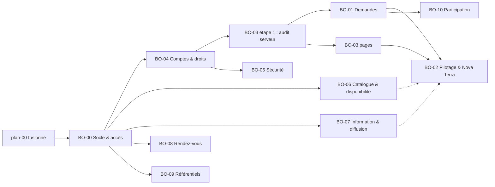

# Plans de dynamisation du back-office (Agent et Admin)

État au 3 octobre 2026, vague 12 : 67 demandes visibles sur l'API Terra Nova.

Le back-office (`frontend/src/backoffice/`) est entièrement dessiné, mais chaque écran lit des stores zustand simulés (`stores/`), remplis par `mocks/`. Ces plans décrivent comment brancher chaque écran Agent et Admin sur l'API Express. Ils incluent aussi les ajouts backend dont le back-office a besoin.

## Différence avec `project-plan/`

- **`project-plan/`** décrit chaque fonctionnalité de bout en bout : backend, espace citoyen et back-office, jusqu'à la vague 7.
- **Ce dossier** ne garde que le back-office. Les réfs y sont regroupées par **type de travail** et par **rôle** (Agent, Admin) tel qu'on les rencontre dans le back-office. Il couvre aussi les vagues 8 à 12 (D02, F49 à F68).
- **Travail commun aux deux dossiers :** un ajout backend présent dans les deux (par exemple `AuditLog` ou `Broadcast`) ne se fait qu'une fois. On coche alors l'étape dans les deux plans.
- **Côté citoyen :** les nouvelles demandes (D02, F49 à F68) ne sont pas encore planifiées dans `project-plan/`. Ces plans n'en traitent que la partie back-office et backend.

## Point de départ

- **Socle technique :**
  - La branche `plan-00` (commit `bfd78b4`) contient le socle technique : couche `src/api/`, session JWT, TanStack Query, `ErrorSummary` et `Field` avec erreur dans le back-office, page Paramètres branchée, seed de démonstration.
  - `main` ne contient pas encore ce socle. Le BO-00 commence donc par fusionner `plan-00`.
- **Prérequis :** le backend tourne (`npm run dev`, port 9002) et le seed est chargé.
- **Comptes de démonstration :** `agent@novaterra.local` et `admin@novaterra.local`, mot de passe `NovaTerra2026!`.

## Les plans

| Plan | Thème | Rôle dans le BO | Réfs | XP | Dépend de | Effort |
|---|---|---|---|---:|---|---:|
| [BO-00](BO-00-socle-acces-staff.md) | Socle : fusion de `plan-00`, connexion du personnel, gardes, vraie identité, conventions | Agent + Admin | — (pose la garde de D09) | — | `plan-00` | ≈ 3 h |
| [BO-01](BO-01-traitement-demandes-D04-D11-D17-F22-F25-F49.md) | Traitement des demandes et signalements | Agent (traitement), Admin (supervision) | D04 · D11 · D17 · F22 · F25 · F49 | 2 180 | 00, 04 (03) | ≈ 5 h |
| [BO-02](BO-02-pilotage-nova-terra-D19-F50.md) | Pilotage de l'activité et API Nova Terra | Agent (tableau de bord), Admin (vue globale) | D19 · F50 | 1 740 | 00, 01, 03 | ≈ 4 h |
| [BO-03](BO-03-tracabilite-F47-F48.md) | Traçabilité : journal d'audit et historiques | Agent (activité), Admin (audit) | F47 · F48 | 1 600 | 00, 04 | ≈ 4 h |
| [BO-04](BO-04-comptes-droits-D08-D09-F34.md) | Comptes, citoyens et droits | Agent (citoyens), Admin (utilisateurs, rôles) | D08 · D09 · F34 | 1 580 | 00 | ≈ 3 h |
| [BO-05](BO-05-securite-connexions-D02-F37-F53-F54.md) | Sécurité des connexions | Admin (sécurité), Agent (lecture, sans IP), personnel (mon compte) | D02 · F37 · F53 · F54 · F100 | 4 520 | 00, 04, 03 | ≈ 7 h |
| [BO-06](BO-06-catalogue-disponibilite-D05-D07-F28-F38-F63-F64.md) | Catalogue, accueil et disponibilité des services | Admin (catalogue, coupure), Agent (interruptions) | D05 · D07 · F28 · F38 · F63 · F64 | 3 060 | 00 (03) | ≈ 4 h |
| [BO-07](BO-07-information-diffusion-D06-D18-F29-F30-F31.md) | Information et diffusion : annonces, alertes, notifications | Admin, Agent (publication) | D06 · D18 · F29 · F30 · F31 | 3 330 | 00 (03) | ≈ 4 h |
| [BO-08](BO-08-rendez-vous-F39-F40.md) | Rendez-vous : agenda et créneaux | Agent (agenda), Admin (créneaux) | F39 · F40 | 900 | 00 (03) | ≈ 2,5 h |
| [BO-09](BO-09-referentiels-ville-D13-F36-F45-F46.md) | Référentiels de la ville : transports, lieux, lexique | Admin (édition), Agent (lecture, état des lignes) | D13 · F36 · F45 · F46 | 2 170 | 00 (03, 06) | ≈ 5 h |
| [BO-10](BO-10-participation-F51-F52-F65-F66-F67-F68.md) | Participation citoyenne : projets, consultations, idées, soutiens, questions sur les données | Admin (projets, consultations), Agent (modération, réponses) | F51 · F52 · F65 · F66 · F67 · F68 | 4 610 | 00, 01, 03 | ≈ 7 h |

- **Couverture :** 41 réfs ont une partie back-office, pour 25 690 XP.
- **XP :** c'est celle de la demande entière, que le back-office partage avec le front citoyen.
- **Effort :** estimé pour une personne, partie backend comprise.
- **Version minimale :** chaque plan en a une, à suivre si le temps manque.

## Pourquoi ces regroupements

Chaque plan réunit des réfs qui se traitent **dans les mêmes écrans, par le même rôle, sur les mêmes données** :

- **BO-01 :** toutes les réfs qui passent par la file des demandes de l'agent (`CitizenRequest`). Contacts, démarches, signalements, compteur, étapes visibles par l'habitant, avis de changement d'état.
- **BO-02 :** les réfs de suivi global de l'activité.
  - D19 demande de suivre l'activité et le flux Nova Terra.
  - F50 demande un tableau de bord simplifié.
- **BO-03 :** les deux réfs « qui a fait quoi ».
- **BO-04 :** les réfs de profils, de droits et d'administration des comptes.
- **BO-05 :** les réfs de protection des connexions : blocage, double vérification, nouvel appareil, connexion sans mot de passe, et le flux F100 pour les agents. Elles partagent la page Sécurité admin, la page agent, l'écran de connexion et la fiche utilisateur.
- **BO-06 :** ce que l'admin règle pour que l'habitant trouve un service et sache s'il fonctionne. F63 (couper un service) et F64 (voir son état) sont les deux faces d'une même donnée, `ServiceInterruption`.
- **BO-07 :** les réfs de publication vers les habitants.
  - D18, F29 et F31 partagent le même composeur d'alerte.
  - D06 et F30 partagent l'éditeur d'annonces.
- **BO-08 :** le même objet `Appointment`, côté agent et côté admin.
- **BO-09 :** les contenus de référence que l'admin tient à jour : lignes et arrêts, lieux et urgences, termes du lexique.
- **BO-10 :** les six réfs de participation. Elles demandent toutes une contribution « simple » qui « laisse une trace claire ». Elles partagent la modération, les réponses et les soutiens.

## Écrans et plan qui les branche

### Espace Agent (`/agent`)

| Écran | Plan |
|---|---|
| `/agent` Tableau de bord | BO-01 (file, compteur D17) · BO-02 (vue simple, Nova Terra) · BO-03 (activité) |
| `/agent/demandes`, `/agent/demandes/:id` | BO-01 |
| `/agent/signalements` | BO-01 |
| `/agent/rendez-vous` | BO-08 |
| `/agent/citoyens` | BO-04 |
| `/agent/activite` | BO-03 |
| `/agent/nova-terra` | BO-02 |
| **Nouveau** `/agent/contributions` | BO-10 |
| **Nouveaux** `/agent/transports`, `/agent/lexique` (lecture) | BO-09 |
| **Nouveau** `/agent/compte` | BO-05 |
| **Nouveau** `/agent/securite` | BO-05 (F100) |
| `/agent/connexion` | BO-00 |

### Espace Admin (`/admin`)

| Écran | Plan |
|---|---|
| `/admin` Vue globale | BO-02 |
| `/admin/demandes` | BO-01 |
| `/admin/audit` | BO-03 |
| `/admin/utilisateurs`, `/admin/roles` | BO-04 |
| **Nouveau** `/admin/securite` | BO-05 |
| `/admin/services`, `/admin/maintenance` | BO-06 |
| `/admin/annonces`, `/admin/alertes`, `/admin/notifications` | BO-07 |
| `/admin/rendez-vous` | BO-08 |
| **Nouveaux** `/admin/transports`, `/admin/lieux`, `/admin/lexique` | BO-09 |
| **Nouveaux** `/admin/projets`, `/admin/consultations`, `/admin/contributions` | BO-10 |
| `/admin/parametres` | BO-00 (déjà branchée sur `plan-00`) · BO-06 (accueil) · BO-05 (politique de double vérification) |
| `/admin/traductions` | Reste simulée : le multilingue (D14, F27) est exclu |
| **Nouveaux** `/admin/compte`, `/admin/connexion` | BO-05, BO-00 |

## Réfs sans écran back-office

Ces demandes se jouent côté habitant. Certaines imposent quand même une règle au back-office :

| Réfs | Effet sur le back-office |
|---|---|
| D01, D03, D12, D15, D16, F26, F35 | Aucun écran. La référence de demande (D16) est la même dans le back-office. |
| D14, F27 | Exclus. `TranslationsPage` reste simulée et garde la mention « Données simulées ». |
| F32 | Côté agent, le filtre « Nécessite une action » (BO-01) et la palette ⌘K branchée sur les vraies demandes (BO-00, BO-01). |
| F33 | Les demandes d'un compte supprimé restent visibles, sans habitant lié (`citizen_id` nul) : la fiche affiche « Compte supprimé » (BO-04). |
| D20, F21, F23, F24, F41, F42, F43, F44 | Le personnel est aussi concerné. Tous les formulaires du back-office utilisent `Field`, `ErrorSummary` et `useApiForm` (BO-00). Les graphiques gardent leur vue tableau. |
| F55, F56 | Export et récapitulatif côté habitant. Aucun écran back-office. |
| F57, F58, F59, F60, F61, F62 | Le back-office reste chargé à part (`lazy`). Les listes sont paginées par le serveur. Les rafraîchissements s'arrêtent quand l'onglet est caché (BO-00). |

## Dépendances

Les flèches pleines sont bloquantes. Les flèches en pointillé indiquent qu'un encart du plan cible attend ces données.

## Ordre recommandé

1. **BO-00 :** fusion de `plan-00`, connexion, gardes, identité réelle. Sans lui, aucun appel du personnel n'aboutit.
2. **BO-04 :** comptes, et liste du personnel pour l'assignation. Prouve D08 et D09.
3. **BO-03, étape 1 :** le journal d'audit côté serveur. Chaque écran branché ensuite écrit déjà de vraies traces.
4. **BO-01 :** le cœur du travail des agents.
5. **BO-06** et **BO-07**, qui rapportent le plus d'XP parmi les plans de contenus.
6. **BO-08**, puis **BO-02** et les pages du **BO-03**, quand toutes leurs sources de données existent.
7. **BO-05**, en commençant par F37 : le backend est prêt, c'est l'affaire d'une heure.
8. **BO-09**, puis **BO-10**.

## Conventions communes

Le détail est dans le BO-00.

- **Accès aux données :**
  - passer par les hooks de `frontend/src/api/<domaine>.ts`, partagés avec l'espace citoyen ;
  - une page n'appelle jamais axios directement ;
  - une page branchée n'importe plus rien de `backoffice/stores/` ni de `backoffice/mocks/`.
- **Mutations :** une fonction simulée (`changeStatus`, `createAlert`…) devient un hook de mutation. Après la réponse du serveur :
  - le toast s'affiche ;
  - les requêtes concernées sont invalidées ;
  - l'audit est écrit par le serveur, plus jamais par le navigateur.
- **Erreurs :**
  - le `code` renvoyé par l'API est traduit en français ;
  - les erreurs de validation vont sur les champs ;
  - un `403` affiche « Action réservée aux administrateurs ».
- **Repère des écrans simulés :** tant qu'un écran n'est pas branché, son en-tête affiche « Données simulées ».
- **Migrations :** `prisma migrate diff`, puis `migrate deploy` (voir `CLAUDE.md`).
- **Une réf est livrée côté back-office quand :**
  - ses critères sont vérifiés avec les comptes du seed ;
  - côté frontend, `npm run typecheck`, `npm run lint`, `npm run build` et `npm test` passent ;
  - côté backend, `npm run typecheck` passe ;
  - le parcours a été fait au clavier ;
  - `grep -n "stores/\|mocks/"` ne trouve plus rien dans les fichiers des écrans du plan (le toast `stores/toastStore` excepté).

## Suivi

| Plan | Statut | Notes |
|---|---|---|
| BO-00 | Fait | `plan-00` fusionné ; connexion, gardes, identité réelle, cloche, compteurs |
| BO-01 | À faire | |
| BO-02 | À faire | |
| BO-03 | À faire | |
| BO-04 | En cours | Quasi fait (voir plan) ; + test live RolesPage / protection perceptible D09 (4 oct.) |
| BO-05 | À faire | F100, vague 20 |
| BO-06 | À faire | |
| BO-07 | À faire | |
| BO-08 | À faire | |
| BO-09 | En cours | Transports faits (4 oct., avec le PLAN-06) ; lieux et lexique à faire |
| BO-10 | À faire | |

## Quand une nouvelle vague arrive

1. Lire les nouvelles demandes dans la page « API Nova Terra » du back-office, une fois le BO-02 branché.
2. Si la demande a un écran back-office du même type et du même rôle qu'un plan existant, l'ajouter à ce plan :
   - dans le titre ;
   - dans le tableau des réfs ;
   - dans les étapes ;
   - dans les critères.
3. Sinon, créer `BO-NN-<thème>-<RÉFS>.md` avec la même structure :
   - pourquoi ces réfs vont ensemble ;
   - écrans et état actuel ;
   - backend ;
   - branchement écran par écran ;
   - étapes, critères, version minimale.
4. Si elle n'a aucun écran back-office, l'ajouter au tableau « Réfs sans écran back-office ».
5. Mettre à jour les tableaux de ce fichier.
