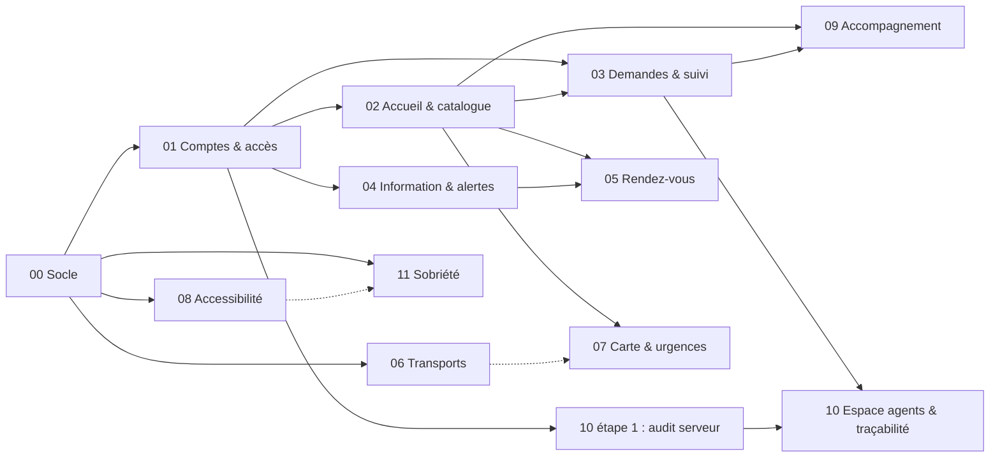

# Plans de dynamisation de Terra Nova

État au 3 octobre 2026, vague 7 : 46 demandes visibles sur l'API Terra Nova, prochaine vague annoncée.

Aujourd'hui :
- **Backend :** il couvre déjà la plupart des demandes (`backend/README.md`).
- **Espace citoyen :** c'est une maquette 3D dont les données sont écrites en dur.
- **Back-office :** il est dessiné, mais lit des stores simulés (`frontend/src/backoffice/mocks`).

Ces plans décrivent comment brancher chaque fonctionnalité sur l'API pour la rendre réelle, ainsi que ce qu'il manque au backend.

## Périmètre

- **Inclus :** 44 demandes, réparties en un socle technique (PLAN-00) et 10 plans. Chaque plan regroupe des demandes complémentaires, qui partagent les mêmes données, écrans ou parcours.
- **Multilingue (ajouté le 4 octobre) :** D14 (choix de la langue de l'interface) et F27 (contenus traduits), français et anglais dans l'espace citoyen : PLAN-12. Le back-office reste en français et sa page Traductions reste simulée.
- **Hors demandes :** les jauges Air / Eau / Énergie (`features/cityStatus`) restent simulées, car aucune demande ne les concerne.

## Les plans

| Plan | Thème | Réfs | XP | Dépend de | Effort |
|---|---|---|---:|---|---:|
| [PLAN-00](00-socle-technique.md) | Socle technique : couche API, session, erreurs, squelette des pages, paramètres, seed | — | — | — | ≈ 4 h |
| [PLAN-01](01-comptes-acces-D01-D03-D08-D09-F33-F34-F37.md) | Comptes, connexion et rôles | D01 · D03 · D08 · D09 · F33 · F34 · F37 | 3 270 | 00 | ≈ 5 h |
| [PLAN-02](02-accueil-catalogue-D05-D07-D15-F28-F32-F38.md) | Accueil, navigation et catalogue des services | D05 · D07 · D15 · F28 · F32 · F38 | 2 170 | 00 (01) | ≈ 5 h |
| [PLAN-03](03-demandes-suivi-D04-D11-D16-D17-F22-F25-F26.md) | Demandes : contact, démarches, signalements et suivi | D04 · D11 · D16 · D17 · F22 · F25 · F26 | 2 390 | 00, 01 (02) | ≈ 6 h |
| [PLAN-04](04-information-alertes-D06-D18-F29-F30-F31.md) | Information, alertes et notifications | D06 · D18 · F29 · F30 · F31 | 3 330 | 00, 01 | ≈ 5 h |
| [PLAN-05](05-rendez-vous-F39-F40.md) | Rendez-vous et rappels | F39 · F40 | 900 | 00, 01, 02, 04 | ≈ 3,5 h |
| [PLAN-06](06-transports-F36.md) | Transports municipaux | F36 | 580 | 00 | ≈ 3 h |
| [PLAN-07](07-carte-urgences-F45-F46.md) | Carte des services et urgences | F45 · F46 | 1 280 | 00, 02 (06) | ≈ 4,5 h |
| [PLAN-08](08-accessibilite-D20-F21-F23-F24-F41-F42-F43-F44.md) | Accessibilité et confort de lecture | D20 · F21 · F23 · F24 · F41 · F42 · F43 · F44 | 4 710 | 00, puis toutes les pages livrées | ≈ 6 h |
| [PLAN-09](09-accompagnement-D12-D13-F35.md) | Accompagnement des nouveaux habitants | D12 · D13 · F35 | 1 140 | 01, 02, 03 (08) | ≈ 4 h |
| [PLAN-10](10-espace-agents-tracabilite-D19-F47-F48.md) | Espace agents, API Nova Terra et traçabilité | D19 · F47 · F48 | 2 350 | 00, 01 (03) | ≈ 5 h |
| [PLAN-11](11-sobriete-F95.md) | Sobriété numérique : ressources chargées et requêtes inutiles | F95 | 1 320 | 00 (08 : version légère F96) | ≈ 6 h |
| [PLAN-12](12-multilingue-D14-F27.md) | Multilingue français / anglais de l'espace citoyen | D14 · F27 | 1 080 | 00 | ≈ 5 h |

Au total, 24 520 XP sont couverts par ces plans (sobriété F95 et multilingue compris). Les efforts sont estimés pour une personne. Chaque plan a une section « Version minimale » à suivre si le temps manque.

## Trouver le plan d'une réf

| Réf | Plan | Réf | Plan | Réf | Plan |
|---|---|---|---|---|---|
| D01 | 01 | D19 | 10 | F32 | 02 |
| D03 | 01 | D20 | 08 | F33 | 01 |
| D04 | 03 | F21 | 08 | F34 | 01 |
| D05 | 02 | F22 | 03 | F35 | 09 |
| D06 | 04 | F23 | 08 | F36 | 06 |
| D07 | 02 | F24 | 08 | F37 | 01 |
| D08 | 01 | F25 | 03 | F38 | 02 |
| D09 | 01 | F26 | 03 | F39 | 05 |
| D11 | 03 | F27 | 12 | F40 | 05 |
| D12 | 09 | F28 | 02 | F41 | 08 |
| D13 | 09 | F29 | 04 | F42 | 08 |
| D14 | 12 | F30 | 04 | F43 | 08 |
| D15 | 02 | F31 | 04 | F44 | 08 |
| D16 | 03 | | | F45 | 07 |
| D17 | 03 | | | F46 | 07 |
| D18 | 04 | | | F47 | 10 |
| | | | | F48 | 10 |
| | | | | F95 | 11 |

## Dépendances

## Ordre recommandé

1. **PLAN-00 Socle**, sans lequel rien d'autre ne se branche.
2. **PLAN-01 Comptes et accès**, parce que tous les écrans dépendent de la session et des rôles.
3. **PLAN-10, étape 1 : audit serveur.** Si le journal existe tôt, chaque page branchée ensuite écrit déjà de vraies traces. Il remplace le `recordAudit()` côté navigateur.
4. **PLAN-03 Demandes**, qui est le cœur de la plateforme : il ouvre le tableau de bord agent et la démo du parcours complet.
5. **PLAN-02 Accueil et catalogue**, puis **PLAN-04 Information et alertes**. Ce sont les plans qui rapportent le plus d'XP après l'accessibilité.
6. **PLAN-05 Rendez-vous**, **PLAN-07 Carte et urgences** et **PLAN-06 Transports**.
7. **PLAN-09 Accompagnement**, puis la suite du **PLAN-10** (pages d'audit, flux Nova Terra, registre).
8. **PLAN-08 Accessibilité.**
   - Ses bases (préférences d'affichage, conversion en `rem`, primitives de formulaire du PLAN-00) se posent tôt.
   - Son audit se refait à la fin de chaque plan.
   - Une passe finale clôt le projet.

### Répartition possible sur quatre personnes

| Couloir | Contenu |
|---|---|
| Backend | Les sections « Backend » de chaque plan, dans l'ordre ci-dessus : paramètres, seed, AuditLog, Broadcast, Place, GlossaryTerm, FeatureDelivery, filtres manquants |
| Front citoyen | Sas, inscription, Mon espace, catalogue, demandes, alertes, rendez-vous, carte, transports, accompagnement |
| Back-office | Remplacement des stores simulés page par page, nouvelles pages (Sécurité, Transports, Lieux, Lexique) |
| Accessibilité et 3D | PLAN-08, mode « Affichage simple », liaison des quartiers avec la scène 3D (faisceaux, mode alerte) |

## Conventions communes

Ces règles sont détaillées dans le PLAN-00 et s'appliquent à tous les plans :

- **Données :** passer par `frontend/src/api/<domaine>.ts`, qui fournit des hooks TanStack Query. Ni le citoyen ni le back-office n'appellent axios directement.
- **Back-office :** une page branchée ne lit plus aucun store de `backoffice/stores/`. Quand plus aucune page n'utilise un store ou un mock, on le supprime.
- **Mutations du personnel :** chacune écrit une entrée d'audit côté serveur (PLAN-10, étape 1). On ne journalise plus rien depuis le navigateur.
- **Erreurs :** le backend renvoie `{ error: { code, message, details } }`. Le front traduit le `code` en français et place les erreurs de validation (`details.fieldErrors`) sur les champs concernés.
- **Formulaires :** utiliser les primitives accessibles (`Field`, `ErrorSummary`, `useApiForm`) pour que F42 soit respecté dès la création.
- **Temps réel :** il est simulé par des rafraîchissements périodiques ; les intervalles de référence sont définis dans le PLAN-00.
- **Migrations backend :** suivre la méthode `prisma migrate diff`, puis `migrate deploy`, décrite dans `CLAUDE.md`.
- **Une demande est livrée quand :**
  - ses critères d'acceptation sont vérifiés sur des données du seed ;
  - `npm run typecheck`, `npm run lint`, `npm run build` et `npm test` passent côté frontend ;
  - `npm run typecheck` passe côté backend ;
  - le parcours a été fait au clavier ;
  - le registre (PLAN-10) indique la demande comme livrée.

## Suivi

| Plan | Statut | Notes |
|---|---|---|
| 00 | Fait (3 oct.) | Paramètres, seed du scénario, CORS, `src/api`, console `/ville/*`, formulaires accessibles, page Paramètres branchée. Écarts : § 10 du plan |
| 01 | En cours | Preuve D09/F37 perceptible (4 oct.) : RolesPage test live, bannière Mon espace, `scope=all` interruptions staff-only — voir spec `docs/superpowers/specs/2026-10-04-admin-data-protection-design.md` |
| 02 | À faire | |
| 03 | À faire | |
| 04 | À faire | |
| 05 | À faire | |
| 06 | Fait (4 oct.) | `/ville/transports` (réseau, mes arrêts et favoris, recherche, fiche ligne par sens), bloc Transports de l'accueil, `/admin` et `/agent/transports`, horaires aller-retour. Écarts : § 9 du plan |
| 07 | À faire | |
| 08 | À faire | |
| 09 | À faire | |
| 10 | À faire | |
| 11 | En cours | Étapes 0–1 faites : mesure de référence, bundles (back-office et pages hors film −79 %) |
| 12 | En cours (4 oct.) | Socle `src/i18n`, sélecteur FR/EN, écrans citoyens (annonces, transports, version légère inclus). Reste : traductions EN du seed (§ 4 du plan) |

## Quand une nouvelle vague arrive

1. Lire les nouvelles demandes, par exemple dans la page « API Nova Terra » du back-office.
2. Si une demande complète un plan existant, parce qu'elle touche les mêmes données ou le même parcours, l'ajouter à ce plan :
   - dans le titre et le tableau des réfs ;
   - dans les étapes ;
   - dans les critères d'acceptation.
3. Sinon, créer `NN-<thème>-<RÉFS>.md` en suivant la structure des plans existants : objectif, existant, backend, front citoyen, back-office, étapes, critères, version minimale.
4. Mettre à jour la matrice des réfs, le graphe de dépendances et le tableau de suivi ci-dessus.
